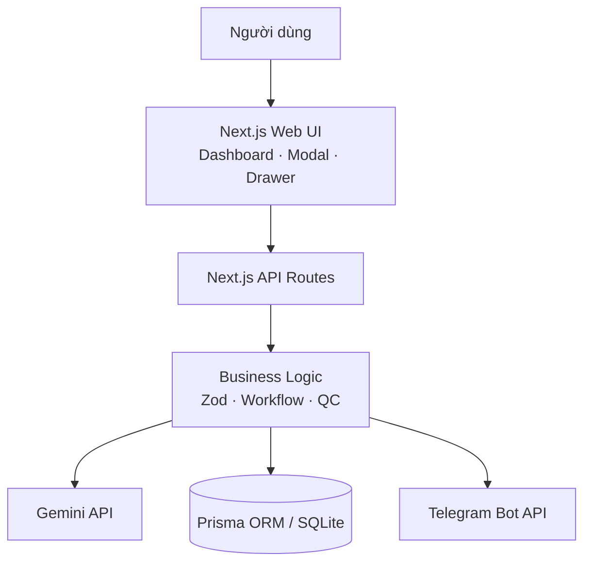
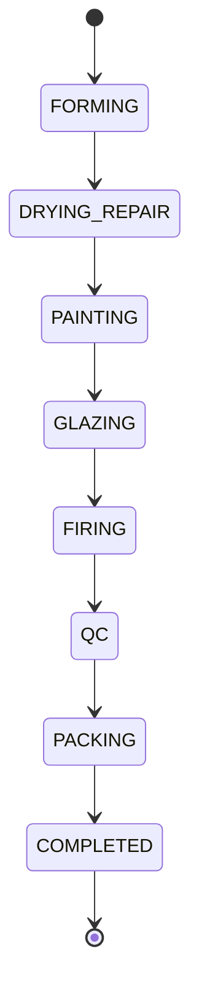

<p align="center">
  
</p>

<h1 align="center">Gốm Production Pipeline</h1>

<p align="center">
  <strong>Hệ thống điều phối &amp; giám sát quy trình sản xuất xưởng gốm tích hợp AI &amp; Telegram.</strong>
</p>

## Giới thiệu bài toán

Trong xưởng gốm, thông tin đơn hàng thường bắt đầu từ mô tả tự nhiên và phải được chuyển thành thông số sản xuất, kế hoạch nguyên liệu, tiến độ công đoạn và kết quả kiểm định. Nếu thực hiện thủ công, dữ liệu dễ thiếu nhất quán, khó theo dõi lịch sử và chậm phản hồi khi có lỗi.

Gốm Production Pipeline là một Working MVP giải quyết luồng này từ đầu đến cuối: AI phân tích mô tả đơn hàng, người dùng kiểm tra dữ liệu có cấu trúc, hệ thống tạo mẻ, điều phối workflow tuần tự, ghi nhật ký kiểm toán, gửi Telegram và quản lý QC trên một dashboard Kanban tiếng Việt.

## Mục tiêu

- Chuẩn hóa đơn hàng tự nhiên thành dữ liệu sản xuất có thể kiểm tra và lưu trữ.
- Bảo đảm mẻ chỉ đi qua đúng thứ tự công đoạn do backend kiểm soát.
- Cho phép theo dõi trạng thái, lịch sử và QC trên một giao diện gọn, dễ demo.
- Thông báo kịp thời qua Telegram nhưng không để lỗi notification ảnh hưởng dữ liệu sản xuất.
- Giữ kiến trúc đủ rõ cho technical test, không thêm hạ tầng vượt quá nhu cầu MVP.

## Chức năng chính

- Phân tích mô tả đơn hàng bằng Gemini Structured Output.
- Validate request và kết quả AI bằng Zod; cho người dùng review trước khi lưu.
- Tạo mã mẻ duy nhất dạng `GOM-YYYYMMDD-XXXX`.
- Dashboard Kanban gồm tám công đoạn và thống kê tổng quan.
- Tự cập nhật dữ liệu khoảng 2 giây một lần bằng polling.
- State machine chỉ cho phép chuyển sang công đoạn kế tiếp.
- Chống double-click và stale update bằng optimistic concurrency.
- Nhật ký kiểm toán cho tạo mẻ, AI, chuyển công đoạn, QC và Telegram.
- Thông báo Telegram cho chuyển công đoạn, vào lò, hoàn thành và kết quả QC.
- QC report do backend tự tính số đạt và tỷ lệ lỗi.
- Theo dõi lượng token Gemini mà ứng dụng đã ghi nhận.

> Dashboard cung cấp trải nghiệm **near-real-time bằng polling khoảng 2 giây**. Đây không phải WebSocket realtime.

## Công nghệ sử dụng

| Lớp | Công nghệ | Vai trò |
| --- | --- | --- |
| Web | Next.js 16, App Router, React 19 | UI và Route Handlers trong cùng ứng dụng |
| Ngôn ngữ | TypeScript strict | An toàn kiểu dữ liệu xuyên suốt frontend/backend |
| Styling | Tailwind CSS 4 | Giao diện responsive, không dùng UI framework nặng |
| Database | SQLite | Lưu trữ gọn nhẹ cho local demo/MVP |
| ORM | Prisma 7, `@prisma/adapter-better-sqlite3` | Schema, migration, transaction và truy vấn dữ liệu |
| Validation | Zod 4 | Kiểm tra input API, output AI và ràng buộc nghiệp vụ |
| AI | Gemini, SDK chính thức `@google/genai` | Structured analysis và ước tính sản xuất |
| Notification | Telegram Bot HTTP API | Thông báo transition và QC alert |
| Icons | Lucide React | Một nguồn icon thống nhất trong UI |
| Testing | `node:test` qua `tsx` | Unit test cho core business logic |

Yêu cầu môi trường: Node.js `>= 20.19.0` và Yarn `>= 4.18.0 < 5`.

## Kiến trúc hệ thống



Ứng dụng dùng kiến trúc monolith có phân lớp: component chỉ xử lý giao diện, Route Handler làm HTTP boundary, còn validation và nghiệp vụ nằm trong `src/lib`. Prisma Client là singleton trên `globalThis` để tránh tạo nhiều connection khi Next.js hot reload trong môi trường development.

Các thay đổi dữ liệu quan trọng được bao bởi transaction:

- Tạo `Batch` cùng log `BATCH_CREATED` và `AI_ANALYZED`.
- Cập nhật stage cùng log `STAGE_TRANSITION`.
- Tạo `QCReport` cùng log `QC_REPORTED`.

## Luồng dữ liệu đầu-cuối

1. Người dùng nhập mô tả đơn hàng bằng tiếng Việt.
2. `/api/analyze` validate mô tả rồi gửi request server-side đến Gemini.
3. Gemini trả structured JSON; kết quả được parse và validate lại bằng Zod.
4. UI hiển thị toàn bộ thông số và giả định để người dùng kiểm tra.
5. Sau khi xác nhận, `/api/batches` kiểm tra lại payload và tạo mẻ trong transaction.
6. Mẻ xuất hiện tại `FORMING` trên Kanban; dashboard tiếp tục polling để đồng bộ.
7. Mỗi lần hoàn thành công đoạn, backend tự tính công đoạn kế tiếp, cập nhật cơ sở dữ liệu và ghi log.
8. Sau khi transaction thành công, hệ thống mới gửi Telegram.
9. Tại `QC`, người dùng submit báo cáo; backend tính kết quả và gửi QC notification.
10. Người dùng review QC rồi chủ động chuyển `QC → PACKING → COMPLETED`.

## Luồng phân tích AI

```text
Natural-language input
→ Gemini
→ structured JSON
→ Zod validation
→ user review
→ persistence
```

Kết quả AI không được tin tưởng trực tiếp. Hệ thống dùng JSON Schema sinh từ cùng Zod schema cho Gemini Structured Output, sau đó vẫn thực hiện `JSON.parse` và Zod validation ở server. Cách làm này giúp phát hiện JSON malformed, field thừa/thiếu, enum sai và các giá trị không hợp lệ như số lượng không dương trước khi dữ liệu tới UI hoặc cơ sở dữ liệu.

Các lớp bảo vệ chính:

- Mô tả được trim, bắt buộc từ 10 đến 2.000 ký tự.
- `GEMINI_API_KEY` và `GEMINI_MODEL` chỉ được đọc trong server module.
- Timeout một request Gemini là 30 giây.
- Khi output malformed hoặc sai schema, hệ thống retry tối đa một lần.
- Raw error, stack trace và API key không được trả về browser.
- Payload tạo batch được validate lại; frontend không thể dùng preview cũ để bỏ qua kiểm tra.
- Token usage được lưu theo cơ chế best-effort; lỗi ghi usage không làm hỏng kết quả phân tích hợp lệ.

Số liệu token trên dashboard chỉ phản ánh các request mà ứng dụng đã ghi nhận trong SQLite, không đại diện cho quota còn lại trên Google AI Studio.

## Workflow state machine



| Stage | Tên hiển thị |
| --- | --- |
| `FORMING` | Tạo hình mộc |
| `DRYING_REPAIR` | Phơi sấy & Sửa mộc |
| `PAINTING` | Vẽ họa tiết |
| `GLAZING` | Tráng men |
| `FIRING` | Nung lò |
| `QC` | Kiểm định chất lượng |
| `PACKING` | Đóng gói |
| `COMPLETED` | Hoàn thành |

Backend là **nguồn dữ liệu chuẩn (source of truth)** của workflow. Frontend chỉ gửi `expectedCurrentStage`, không gửi công đoạn đích tùy ý. Backend đọc công đoạn hiện tại, dùng `getNextStage()` từ ordered workflow duy nhất và chỉ cập nhật nếu cơ sở dữ liệu vẫn ở đúng công đoạn được kỳ vọng.

Transition dùng điều kiện `id + currentStage` trong câu lệnh update. Vì vậy, khi hai request do double-click cùng chạy, chỉ một request có thể thành công; request còn lại nhận `409 WORKFLOW_CONFLICT` thay vì làm mẻ nhảy hai bước. `COMPLETED` không có next stage và không thể transition tiếp.

## Tích hợp Telegram

Telegram không phải nguồn dữ liệu chuẩn. Tin nhắn chỉ được gửi **sau khi transaction nghiệp vụ đã commit**, với timeout 10 giây.

- Transition bình thường: thông báo mẻ, sản phẩm, số lượng và công đoạn kế tiếp.
- Khi vào `FIRING`: nhấn mạnh “ĐÃ VÀO LÒ NUNG” và nhiệt độ nung.
- Khi tới `COMPLETED`: gửi thông báo hoàn tất toàn bộ quy trình.
- Gửi thành công: hệ thống cố ghi `TELEGRAM_SENT`.

Chiến lược khi Telegram lỗi ưu tiên tính đúng của trạng thái sản xuất:

1. Workflow hoặc QC đã lưu thành công sẽ **không rollback** khi Telegram lỗi.
2. Hệ thống cố ghi log `NOTIFICATION_FAILED`.
3. API vẫn trả `success: true` kèm warning `TELEGRAM_FAILED`.
4. Frontend hiển thị cảnh báo rằng nghiệp vụ đã thành công nhưng notification thất bại.

## Cảnh báo QC

QC chỉ được gửi khi mẻ đang ở công đoạn `QC`. Client chỉ gửi số lượng kiểm tra, số lượng lỗi, loại lỗi và ghi chú; backend tự tính:

```text
passedQuantity = inspectedQuantity - defectQuantity
defectRate = defectQuantity / inspectedQuantity × 100
```

Các ràng buộc chính:

- `inspectedQuantity` phải là số nguyên dương và không vượt số lượng của batch.
- `defectQuantity` phải từ 0 đến `inspectedQuantity`.
- `passedQuantity` và `defectRate` từ client không được chấp nhận làm source of truth.
- `defectQuantity = 0` gửi thông báo `QC PASSED`.
- `defectQuantity > 0` gửi `QC ALERT` kèm tỷ lệ và loại lỗi.
- Submit QC không tự động chuyển sang `PACKING`; QC report và stage transition là hai hành động riêng.

## Tổng quan API

| Method | Endpoint | Chức năng |
| --- | --- | --- |
| `POST` | `/api/analyze` | Phân tích mô tả đơn hàng và trả analysis + usage |
| `GET` | `/api/ai-usage` | Tổng hợp token usage ứng dụng đã ghi nhận |
| `GET` | `/api/batches` | Lấy danh sách batch, mới nhất trước |
| `POST` | `/api/batches` | Tạo batch từ dữ liệu đã được review |
| `GET` | `/api/batches/:id` | Lấy batch, logs và QC reports |
| `POST` | `/api/batches/:id/transition` | Chuyển đúng một công đoạn kế tiếp |
| `POST` | `/api/batches/:id/qc` | Tạo QC report tại stage `QC` |

Response thành công và thất bại dùng envelope thống nhất:

```json
{
  "success": true,
  "data": {},
  "warning": {
    "code": "TELEGRAM_FAILED",
    "message": "Công đoạn đã được cập nhật nhưng gửi Telegram thất bại."
  }
}
```

```json
{
  "success": false,
  "error": {
    "code": "WORKFLOW_CONFLICT",
    "message": "Trạng thái mẻ đã thay đổi. Vui lòng tải lại dữ liệu."
  }
}
```

`warning` chỉ xuất hiện khi có cảnh báo không làm thất bại nghiệp vụ chính.

## Tổng quan lược đồ cơ sở dữ liệu

| Entity | Trách nhiệm | Quan hệ/đặc điểm chính |
| --- | --- | --- |
| `Batch` | Thông tin đơn hàng, kết quả AI, ưu tiên và stage hiện tại | `code` unique; một-nhiều với logs và QC reports |
| `StageLog` | Audit trail cho batch, transition, AI, QC và notification | Có `fromStage`, `toStage`, message và metadata |
| `QCReport` | Kết quả kiểm định do backend tính | Một batch có thể có nhiều report |
| `AiUsageRecord` | Token metadata cho từng lần gọi Gemini | Dùng để tổng hợp usage theo model/thời gian |

SQLite lưu JSON qua các field `aiAnalysis` và `metadata`. Xóa batch sẽ cascade tới `StageLog` và `QCReport`. Các index chính phục vụ truy vấn theo stage, priority, thời gian và batch.

## Cấu trúc dự án

```text
gom-production-pipeline/
├── prisma/
│   ├── migrations/               # Lịch sử migration SQLite
│   ├── schema.prisma             # Data model và enums
│   └── seed.ts                   # Ba batch demo
├── public/                       # Logo và static assets
├── src/
│   ├── app/
│   │   ├── api/                  # Next.js Route Handlers
│   │   ├── globals.css           # Design tokens và global styles
│   │   ├── layout.tsx
│   │   └── page.tsx
│   ├── components/               # Dashboard, Kanban, modal, drawer, QC UI
│   ├── generated/prisma/         # Prisma Client được generate, không commit
│   ├── lib/                      # AI, workflow, QC, Telegram, DB, schemas
│   └── types/                    # API DTO dùng phía client
├── .env.example
├── package.json
└── prisma.config.ts
```

## Biến môi trường

Tạo `.env` từ file mẫu:

```bash
cp .env.example .env
```

```dotenv
DATABASE_URL="file:./dev.db"

GEMINI_API_KEY=""
GEMINI_MODEL=""

TELEGRAM_BOT_TOKEN=""
TELEGRAM_CHAT_ID=""
```

| Biến | Bắt buộc | Mục đích |
| --- | --- | --- |
| `DATABASE_URL` | Có | Kết nối SQLite |
| `GEMINI_API_KEY` | Cho phân tích AI | API key Gemini, chỉ dùng server-side |
| `GEMINI_MODEL` | Cho phân tích AI | Tên model Gemini được cấp trong môi trường chạy |
| `TELEGRAM_BOT_TOKEN` | Cho thông báo Telegram | Token của Telegram Bot |
| `TELEGRAM_CHAT_ID` | Cho thông báo Telegram | Chat/group nhận thông báo |

Không đặt secret trong biến `NEXT_PUBLIC_*`. `.env` đã được ignore; repository chỉ lưu `.env.example` không chứa secret thật. Nếu thiếu cấu hình Telegram, workflow và QC vẫn lưu thành công nhưng API trả warning. Nếu thiếu cấu hình Gemini, `/api/analyze` trả `503` với thông báo an toàn.

## Cài đặt và chạy development

```bash
git clone <repository-url> gom-production-pipeline
cd gom-production-pipeline

corepack enable
cp .env.example .env
# Điền GEMINI_API_KEY, GEMINI_MODEL và Telegram config vào .env nếu sử dụng.

yarn install --immutable
yarn prisma migrate deploy
yarn db:seed
yarn dev
```

Mở [http://localhost:3000](http://localhost:3000). `postinstall` đã chạy `prisma generate`; có thể chạy lại thủ công bằng `yarn prisma:generate` khi cần.

## Prisma migration và seed data

Áp dụng các migration đã có khi clone repository:

```bash
yarn prisma migrate deploy
```

Khi chủ động thay đổi `prisma/schema.prisma` trong development:

```bash
yarn db:migrate --name ten_migration
```

Tạo dữ liệu demo:

```bash
yarn db:seed
```

Seed tạo lại ba mã demo cố định tại `FORMING`, `FIRING` và `QC`, đồng thời giữ nguyên các batch khác trong database.

## Build và chạy production

```bash
yarn build
yarn start
```

## Kiểm thử

```bash
yarn lint
yarn typecheck
yarn test
yarn build
```

Bộ test hiện tập trung vào core logic: ordered workflow, Zod schemas, tính toán QC, parser AI structured response, token aggregation và format Telegram message. Setup dùng `node:test` qua `tsx` để giữ MVP nhẹ.

## Luồng demo

1. Mở dashboard và quan sát thống kê, Gemini usage, Kanban tám công đoạn.
2. Chọn **Tạo mẻ sản xuất**, nhập mô tả đơn hàng rồi bấm **Phân tích bằng AI**.
3. Kiểm tra dữ liệu có cấu trúc, mức ưu tiên, các ước tính và giả định.
4. Xác nhận tạo mẻ; kiểm tra card mới tại **Tạo hình mộc** và hai initial logs.
5. Mở batch detail, hoàn thành công đoạn và kiểm tra Telegram notification.
6. Chuyển tuần tự tới **Nung lò**, quan sát message đặc biệt có nhiệt độ nung.
7. Tại **QC**, submit một report có lỗi nứt men và kiểm tra QC Alert.
8. Review report, chuyển sang **Đóng gói** rồi **Hoàn thành**.
9. Kiểm tra progress 100%, audit logs và card tại cột Hoàn thành.

## Chiến lược xử lý lỗi

| HTTP | Trường hợp điển hình | Cách xử lý |
| --- | --- | --- |
| `400` | JSON/input sai format, mô tả quá ngắn | Zod từ chối trước business logic |
| `404` | Batch không tồn tại | Trả error envelope thân thiện |
| `409` | Stale stage, double action, stage đã hoàn thành, QC sai stage | Không thay đổi dữ liệu; yêu cầu client refresh |
| `422` | AI output sai schema sau retry hoặc QC vượt số lượng batch | Trả lỗi nghiệp vụ rõ ràng |
| `500` | Database hoặc lỗi ngoài dự kiến | Log loại lỗi phía server, không trả stack trace |
| `503` | Gemini thiếu cấu hình, timeout hoặc không khả dụng | Không expose raw provider error hay secret |

Frontend có trạng thái đang tải, vô hiệu hóa nút trong lúc gửi request, hiển thị lỗi tiếng Việt và phân biệt cảnh báo Telegram với lỗi nghiệp vụ. Cơ sở dữ liệu luôn là nguồn trạng thái chính.

## Đánh đổi kiến trúc

- **Next.js full-stack monolith:** nhanh triển khai và dễ review; chưa cần tách service cho quy mô MVP.
- **SQLite:** gần như không cần setup, phù hợp demo; đánh đổi khả năng scale nhiều instance và tải ghi lớn.
- **Polling 2 giây:** đơn giản, ổn định cho dashboard nhỏ; tạo request lặp lại nhiều hơn WebSocket/SSE khi số người dùng tăng.
- **Telegram sau DB commit:** production state luôn đúng; response có thể chậm thêm tối đa thời gian timeout notification.
- **Synchronous notification:** dễ quan sát trong demo; chưa có retry queue, outbox hoặc dead-letter flow.
- **Unit test tập trung core logic:** tỷ lệ giá trị/độ phức tạp tốt cho technical test; chưa thay thế integration và E2E test.

## Giới hạn hiện tại

- Chưa có authentication, authorization, multi-tenant hoặc rate limiting.
- SQLite phù hợp single-instance/local demo hơn production phân tán.
- Chưa có pagination/retention cho batch, logs, QC reports và AI usage.
- Telegram không tự động thử lại; lỗi được ghi log và hiển thị cảnh báo.
- Nhiều QC report được phép cho cùng một batch; chưa có idempotency key chống double-submit đồng thời.
- UI yêu cầu có QC report trước khi chuyển tiếp, nhưng backend transition hiện chưa ép điều kiện này như một invariant độc lập.
- Automated tests chưa bao phủ Prisma transaction, API integration, race concurrency, external transport và UI/E2E.
- Gemini usage là số liệu ứng dụng ghi nhận, không phải quota hay chi phí chính thức của tài khoản.
- Chưa có actor identity trong audit log vì MVP không triển khai authentication.

## Hướng phát triển

- Chuyển sang PostgreSQL và bổ sung database constraints cho production.
- Validate toàn bộ env bằng một Zod schema tại startup.
- Thêm idempotency cho tạo batch và QC submission.
- Áp dụng transactional outbox + background worker để retry Telegram.
- Bổ sung integration test cho Prisma/API/concurrency và E2E cho luồng chính.
- Thêm authentication, role/permission, rate limiting và audit actor khi mở rộng phạm vi.
- Thêm pagination, filter, search, observability, request ID và structured logging.
- Cân nhắc SSE/WebSocket chỉ khi quy mô sử dụng thực sự cần realtime push.

## Video Demo Script – 2 đến 3 phút

Kịch bản dưới đây rút gọn đúng trình tự của video tham chiếu 04:27. Khi dựng bản 2–3 phút, nên bỏ đoạn cài đặt, dùng jump-cut cho các transition lặp lại và dành thời gian cho AI, Telegram, QC cùng audit log.

| Mốc | Hình ảnh/thao tác | Lời trình bày gợi ý |
| --- | --- | --- |
| **0:00** | Tổng quan dashboard | “Đây là Gốm Production Pipeline, dashboard điều phối mẻ theo tám công đoạn. Các thống kê và Kanban được cập nhật gần thời gian thực bằng polling mỗi hai giây.” |
| **0:15** | Mở modal, nhập order description | “Người dùng chỉ cần nhập yêu cầu bằng ngôn ngữ tự nhiên, gồm sản phẩm, số lượng, kích thước, men, nhiệt độ nung và deadline.” |
| **0:30** | Bấm **Phân tích bằng AI** | “Mô tả được gửi server-side tới Gemini dưới dạng structured output; API key không xuất hiện ở browser.” |
| **0:45** | Hiển thị structured result | “Kết quả đi qua Zod validation và luôn được review trước khi lưu: thông số sản phẩm, vật liệu ước tính, thời gian nung, ưu tiên và các giả định.” |
| **1:00** | Bấm **Xác nhận & Tạo mẻ** | “Backend validate lại payload rồi tạo batch cùng initial logs trong một transaction.” |
| **1:15** | Card mới xuất hiện trên Kanban | “Mẻ bắt đầu tại Tạo hình mộc và dashboard tự đồng bộ mà không reload toàn trang.” |
| **1:25** | Mở drawer, hoàn thành stage đầu | “Workflow là state machine tuần tự. Frontend không chọn stage đích; backend tự tính bước kế tiếp và chống double-click bằng expectedCurrentStage.” |
| **1:35** | Chuyển sang Telegram | “Chỉ sau khi database commit, Telegram mới nhận thông báo. Khi Telegram lỗi, trạng thái sản xuất vẫn được giữ và UI nhận warning.” |
| **1:50** | Jump-cut các transition tới QC | “Các công đoạn tiếp tục theo đúng thứ tự. Khi vào lò, thông báo nhấn mạnh nhiệt độ nung; sau đó mẻ chuyển tới Kiểm định chất lượng.” |
| **2:05** | Submit QC với 10 sản phẩm lỗi, loại lỗi **Nứt men** | “Backend không tin số đạt hay tỷ lệ từ client mà tự tính từ số lượng kiểm tra và số lượng lỗi.” |
| **2:15** | Hiển thị Telegram QC Alert | “Vì có lỗi, quản lý nhận QC Alert gồm số lỗi, tỷ lệ lỗi và loại lỗi cần xử lý.” |
| **2:30** | Mở timeline/logs, lướt architecture trong README | “Mọi hành động đều có audit trail. Kiến trúc tách UI, API và business logic; Business Logic kết nối Gemini, Prisma/SQLite và Telegram.” |
| **2:45** | Kết luận tại card/detail hoàn thành | “MVP hoàn thiện luồng từ mô tả tự nhiên đến mẻ sản xuất, workflow, QC, notification và trạng thái hoàn thành, với database là source of truth.” |
